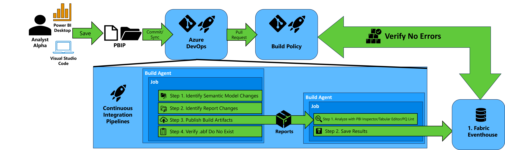

# Power BI Teams More Analytic Support

A comprehensive solution for automated analysis of Power BI reports and semantic models using Azure DevOps pipelines, Microsoft Fabric Eventhouse, and various analysis tools including PBIR Inspector, Tabular Editor, and PQ Lint.

## Architecture Overview



This solution provides automated quality assurance and analysis for Power BI projects by:
- Triggering analysis pipelines when changes are made to Power BI projects
- Running multiple analysis tools (PBIR Inspector, Tabular Editor BPA, PQ Lint) on reports and semantic models
- Storing results in Microsoft Fabric Eventhouse for centralized reporting and monitoring
- Implementing branch policies to prevent deployment of reports with critical issues


## Prerequisites

### Required Services and Accounts

1. **Microsoft Fabric Workspace**
   - Premium capacity or Fabric capacity required
   - Eventhouse capability enabled
   - Service principal with Member or Admin rights

2. **Azure DevOps Organization**
   - Project with appropriate permissions
   - Ability to create pipelines and variable groups
   - PAT token with Code (read/write) and Build (read/execute) permissions

3. **Service Principal (App Registration)**
   - Registered in Azure Active Directory
   - Client ID and Client Secret available
   - Added as Member to the Fabric workspace
   - Power BI Service Admin or sufficient permissions for workspace access

### Required Tools (Automatically Downloaded by Pipelines)
- PBIR Inspector CLI
- Tabular Editor 2
- PQ Lint API access
- `pql-test` (from TestPyPI)
- `fabric-cicd`

## Setup Instructions

### Step 1: Setup Git Integration and Repository Access

**Note:** This repository is automatically created when you enable Git Sync in your Microsoft Fabric workspace.

1. **Enable Git Integration in Fabric Workspace**
   ```
   1. Navigate to your Microsoft Fabric workspace
   2. Go to Workspace Settings → Git integration
   3. Connect to your Azure DevOps organization and project
   4. Select this repository for Git sync
   5. Configure branch settings (typically 'main' as working branch)
   ```

2. **Verify Repository Structure**
   ```
   1. Navigate to Azure DevOps → Repos
   2. Confirm this repository appears in your project
   3. Verify the Scripts folder and YAML pipeline files are present
   4. Set up branch permissions and policies as needed
   ```

3. **Configure Additional Git Settings**
   ```
   1. Set up default branch (typically 'main')
   2. Configure branch permissions
   3. Enable pull request workflows
   ```

### Step 2: Create Microsoft Fabric Eventhouse

1. **Create Eventhouse**
   ```
   1. Navigate to Microsoft Fabric workspace
   2. Click "New" → "Eventhouse"
   3. Provide name (e.g., "PowerBI-Analytics-Hub")
   4. Note the Query URI (Cluster URL) from the Eventhouse properties
   ```

2. **Create Database**
   ```
   1. In the Eventhouse, create a new database
   2. Name it appropriately (e.g., "pbi_analytics")
   3. Note the database name for configuration
   ```

### Step 3: Create Variable Group in Azure DevOps

1. **Navigate to Library**
   ```
   Azure DevOps Project → Pipelines → Library → Variable Groups → + Variable Group
   ```

2. **Create Variable Group Named: `MYPBITMA-EVENTHOUSE`**

   | Variable Name | Description | Example Value |
   |---------------|-------------|---------------|
   | `ADO_TOKEN` | Personal Access Token for Azure DevOps | `ghp_xxxxxxxxxxxxxxxxxxxx` |
   | `TENANT_ID` | Azure AD Tenant ID | `12345678-1234-1234-1234-123456789012` |
   | `CLIENT_ID` | Service Principal Application ID | `87654321-4321-4321-4321-210987654321` |
   | `CLIENT_SECRET` | Service Principal Secret (Mark as Secret) | `your-client-secret` |
   | `CLUSTER_URL` | Eventhouse Query URI | `https://your-eventhouse.z1.kusto.fabric.microsoft.com` |
   | `DATABASE` | Eventhouse Database Name | `pbi_analytics` |
   | `UPSTREAM_PIPELINE_ID` | Pipeline ID that triggers analysis | `123` |
   | `PQLINT_SUBSCRIPTION_KEY` | PQ Lint API Key (if required) | `your-api-key` |
   | `FABRIC_CICD_DEPLOY_COMMAND` | Optional override command for model deployment with fabric-cicd | `fabric-cicd deploy --source '/path/to/model'` |
   | `PQL_ASSERT_COMMAND` | Optional override command for running `pql-test` assertions | `pql-test assert --path '/path/to/model' --format json` |

3. **Security Configuration**
   ```
   - Mark CLIENT_SECRET as secret variable
   - Mark PQLINT_SUBSCRIPTION_KEY as secret variable (if used)
   - Set appropriate permissions for the variable group
   ```

### Step 4: Create Analysis Pipelines

#### Pipeline 1: PBIR Inspector Analysis (Eventhouse)

1. **Create Pipeline**
   ```
   1. Go to Pipelines → New Pipeline
   2. Select "Azure Repos Git"
   3. Choose your repository
   4. Select "Existing Azure Pipelines YAML file"
   5. Choose "Scripts/pbir-inspector-eventhouse.yml"
   6. Name: "PBIR Inspector Analysis"
   ```

2. **Configuration**
   ```
   - Triggered by: PBIP-CI pipeline completion
   - Analyzes: Power BI Reports (.Report folders)
   - Output: JSON results stored in Eventhouse
   - Tables Created: pbir_inspector_results
   ```

#### Pipeline 2: Tabular Editor Best Practices Analysis (Eventhouse)

1. **Create Pipeline**
   ```
   1. Follow same process as Pipeline 1
   2. Select "Scripts/tabular-editor-eventhouse.yml"
   3. Name: "Tabular Editor BPA Analysis"
   ```

2. **Configuration**
   ```
   - Triggered by: PBIP-CI pipeline completion
   - Analyzes: Semantic Models (.SemanticModel folders)
   - Output: JSON results with best practice violations
   - Tables Created: tabular_editor_bpa_results
   ```

#### Pipeline 3: PQ Lint Analysis (Eventhouse)

1. **Create Pipeline**
   ```
   1. Follow same process as Pipeline 1
   2. Select "Scripts/pq-lint-eventhouse.yml"
   3. Name: "PQ Lint Analysis"
   ```

2. **Configuration**
   ```
   - Triggered by: PBIP-CI pipeline completion
   - Analyzes: Power Query M code in semantic models
   - Output: Code quality and performance recommendations
   - Tables Created: pq_lint_results
   ```

#### Pipeline 4: Check Eventhouse for Errors (Build Policy)

1. **Create Pipeline**
   ```
   1. Follow same process as Pipeline 1
   2. Select "Scripts/check-eventhouse-for-errors.yml"
   3. Name: "Quality Gate - Check Analysis Results"
   ```

2. **Configuration**
   ```
   - Purpose: Quality gate for branch policies
   - Queries: Eventhouse for critical errors
   - Output: Pass/Fail status for branch protection
   ```

   #### Pipeline 5: `pql.assert` Deployment + Assertion Analysis (Eventhouse)

   1. **Create Pipeline**
      ```
      1. Follow same process as Pipeline 1
      2. Select "Scripts/pql-assert-eventhouse.yml"
      3. Name: "pql.assert"
      ```

   2. **Configuration**
      ```
      - Triggered by: PBIP-CI pipeline completion
      - Deploys: Semantic models using fabric-cicd before assertion tests
      - Runs: pql-test assertion suite and captures JSON output
      - Output: Normalized assertion results in Eventhouse
      - Bronze Table: pql_assert_bronze
      - Silver Tables: pql_assert_tests_silver, pql_assert_commits_silver, pql_assert_test_results_silver
      - Combined Model: Included in tests_silver_combined, commits_silver_combined, test_results_silver_combined
      - Data Contract: ID, Name, Description, Severity, Passed, Details, RepositoryId, BranchName, CommitId, CommittedBy, LogicalId, SemanticModelName, Timestamp, DeploymentStatus, DeploymentDetails
      ```

   3. **Quality Gate Behavior**
      ```
      - pql.assert is monitor-only by default in this repository configuration.
      - The existing "Quality Gate - Check Analysis Results" pipeline is unchanged.
      ```

### Step 5: Configure Branch Policies

#### Create Protected Branches

1. **Create UAT Branch**
   ```
   1. Navigate to Repos → Branches
   2. Create new branch from main: "uat"
   3. Set as protected branch
   ```

2. **Protect Main Branch**
   ```
   1. Navigate to Project Settings → Repos → Policies
   2. Select "main" branch
   3. Configure branch policies
   ```

#### Configure Branch Policy Rules

1. **Required Build Validation**
   ```
   Policy: Build validation
   Build pipeline: "Quality Gate - Check Analysis Results"
   Path filter: Include all paths
   Policy requirement: Required
   ```

2. **Minimum Number of Reviewers**
   ```
   Minimum number of reviewers: 1
   Allow requestors to approve: No
   Allow completion even if some reviewers vote "Waiting"
   Reset code reviewer votes when there are new changes: Yes
   ```

3. **Check for Linked Work Items**
   ```
   Enable: Check for linked work items
   Policy requirement: Optional (or Required based on your process)
   ```

4. **Check for Comment Resolution**
   ```
   Enable: Check for comment resolution
   Policy requirement: Required
   ```

## Usage Workflow

### Development Process

1. **Developer makes changes to Power BI project**
   - Edits reports, semantic models, or datasets
   - Commits changes to feature branch

2. **Create Pull Request to UAT/Main**
   - Pull request triggers quality gate pipeline
   - Pipeline checks Eventhouse for critical issues from recent analysis

3. **Automated Analysis (Triggered by PBIP-CI)**
   - PBIR Inspector analyzes report structure and compliance
   - Tabular Editor runs best practice analysis on semantic models
   - PQ Lint analyzes Power Query code quality
   - pql.assert deploys semantic models with fabric-cicd and runs assertion tests

4. **Results Storage and Monitoring**
   - All results stored in Eventhouse tables
   - Create Power BI reports on Eventhouse data for monitoring
   - Set up alerts for critical issues

### Monitoring and Reporting

1. **Create Monitoring Dashboard**
   ```
   - Connect Power BI to Eventhouse
   - Create reports showing:
     * Analysis trends over time
     * Critical issues by repository/branch
     * Code quality metrics
     * Best practice compliance scores
   ```

2. **Set Up Alerts**
   ```
   - Configure alerts for critical violations
   - Email notifications for failed quality gates
   - Teams notifications for analysis completion
   ```

## Troubleshooting

### Common Issues

1. **Pipeline Fails - Authentication**
   ```
   - Verify service principal permissions
   - Check CLIENT_ID and CLIENT_SECRET are correct
   - Ensure service principal has Fabric workspace access
   ```

2. **Eventhouse Connection Issues**
   ```
   - Verify CLUSTER_URL format
   - Check DATABASE name matches created database
   - Ensure service principal has Eventhouse permissions
   ```

3. **Analysis Tools Not Found**
   ```
   - Pipelines automatically download tools
   - Check internet connectivity from build agents
   - Verify tool download URLs are accessible
   ```

### Debug Steps

1. **Enable Verbose Logging**
   ```yaml
   # Add to pipeline steps
   - powershell: |
       Write-Host "##[debug]Debug information here"
   ```

2. **Test Eventhouse Connection**
   ```kql
   // Test query in Eventhouse
   .show tables
   ```

3. **Validate Service Principal**
   ```powershell
   # Test authentication
   Connect-PowerBIServiceAccount -ServicePrincipal -Credential $cred -TenantId $tenantId
   ```

## Contributing

1. Fork the repository
2. Create a feature branch
3. Make your changes
4. Test with sample Power BI projects
5. Submit a pull request

## Support

For issues and questions:
1. Check the troubleshooting section
2. Review pipeline logs in Azure DevOps
3. Create an issue in this repository
4. Contact the development team